# Graph Visualization

Gdy user prosi o wizualizację grafu, wygeneruj diagram Mermaid.

## Procedura

### Krok 1: Wygeneruj bazowy diagram

Znajdź plik grafu `src/graphs/[name]/[name].graph.ts` i uruchom skrypt:

```bash
cd apps/main && npx tsx ../../.claude/skills/langchain/visualize-graph.ts \
  src/graphs/[name]/[name].graph.ts \
  src/graphs/[name]/[name].graph.md
```

Skrypt generuje diagram z **static edges** (`addEdge`). Node'y używające `Command` routing nie mają statycznych połączeń — trzeba je dodać w kroku 2.

### Krok 2: Dodaj Command routing edges

1. **Znajdź node'y z Command routing** — przeczytaj każdy `*.node.ts` w folderze grafu. Node z Command routing to taki, który zwraca `new Command({ goto: ... })`.

2. **Wyciągnij wszystkie `goto` targety** z każdego takiego node'a:
   - `goto: "nodeName"` — pojedynczy target
   - `goto: variable` — sprawdź skąd bierze się wartość (routing map, if/switch)
   - `goto: END` — połączenie do `__END__`

3. **Dodaj linie z labelami** do wygenerowanego `.graph.md`

### Krok 3: Oznacz typy node'ów

Każdy node musi mieć oznaczenie typu za pomocą `classDef`:

- **`:::llm`** — node wywołuje LLM (generuje koszty). W labelu dodaj nazwę modelu, np. `"router (Haiku)"`
- **`:::logic`** — czysta logika, zero wywołań LLM (zero kosztów)
- **`:::interrupt`** — node z `interrupt()` (HITL)


To pozwala na pierwszy rzut oka zobaczyć, które node'y generują koszty LLM, a które są darmowe.

## Format diagramu

```mermaid
graph TD
    classDef llm fill:#333,stroke:#1e88e5
    classDef logic fill:#333,stroke:#616161

    __START__([__start__])
    nodeA["nodeA"]:::logic
    nodeB["nodeB (Haiku)"]:::llm
    __END__([__end__])

    __START__ --> nodeA
    nodeA -->|"condition"| nodeB
    nodeB --> __END__
```



**Konwencje:**

- `([...])` — stadium shape dla START/END
- `["..."]` — prostokąt dla node'ów (z `:::llm` lub `:::logic`)
- `-->|"label"|` — strzałka z warunkiem
- `-->` — strzałka bez warunku
- Zawsze dodawaj `classDef llm` i `classDef logic` na początku diagramu

## Command routing patterns

### Routing map

```typescript
const routes: Record<SomeType, string> = {
  option_a: "nodeX",
  option_b: "nodeY",
  option_c: "nodeY",
};
return new Command({ goto: routes[value] });
```

W diagramie:

```
sourceNode -->|"option_a"| nodeX
sourceNode -->|"option_b"| nodeY
sourceNode -->|"option_c"| nodeY
```

### If/else

```typescript
if (condition) {
  return new Command({ goto: "nodeX" });
}
return new Command({ goto: "nodeY" });
```

W diagramie:

```
sourceNode -->|"condition true"| nodeX
sourceNode -->|"condition false"| nodeY
```
