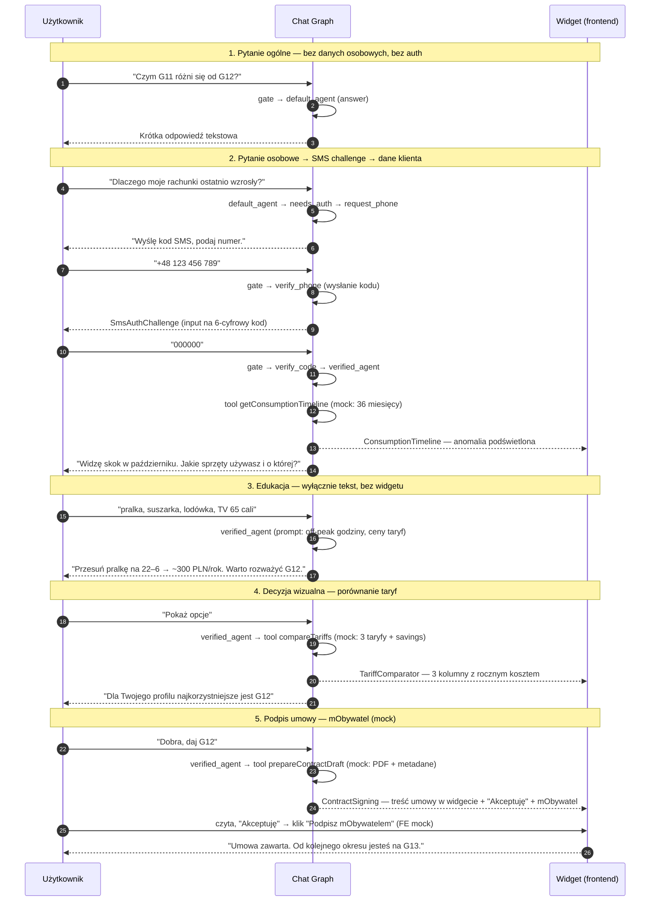

# Architektura grafu

```mermaid
graph LR
    classDef llm fill:#333,stroke:#1e88e5
    classDef logic fill:#333,stroke:#616161
    classDef auth fill:#333,stroke:#ffc107
    classDef tool fill:#333,stroke:#43a047
    classDef widget fill:#222,stroke:#e91e63,stroke-dasharray:3 3

    __START__([__start__])
    __END__([__end__])

    gate["gate"]:::logic

    default_agent["default_agent · Sonnet"]:::llm
    spam["spam · ≥3 → blocked"]:::logic
    escalation["escalation"]:::logic

    request_phone["request_phone"]:::auth
    verify_phone["verify_phone · eligibility stub"]:::auth
    verify_code["verify_code"]:::auth

    verified_agent["verified_agent · Sonnet<br/>tool-calling loop"]:::llm

    subgraph agent_tools["Tools"]
      t_consumption["getConsumptionTimeline"]:::tool
      t_tariffs["compareTariffs"]:::tool
      t_contract["prepareContractDraft"]:::tool
      t_escalate["escalateToHuman"]:::tool
    end

    subgraph widgets["Widgets"]
      w_timeline["ConsumptionTimeline"]:::widget
      w_compare["TariffComparator"]:::widget
      w_contract["ContractSigning<br/>(read + accept + mObywatel)"]:::widget
    end

    __START__ --> gate

    gate -->|"blocked"| __END__
    gate -->|"escalated"| __END__
    gate -->|"default"| default_agent
    gate -->|"awaiting phone"| verify_phone
    gate -->|"awaiting code"| verify_code
    gate -->|"verified"| verified_agent

    default_agent -->|"answered"| __END__
    default_agent -->|"needs auth"| request_phone
    default_agent -->|"spam"| spam
    default_agent -->|"needs human"| escalation

    spam --> __END__
    escalation --> __END__
    request_phone --> __END__
    verify_phone --> __END__
    verify_code -->|"invalid"| __END__

    verified_agent -->|"answered"| __END__
    verified_agent -.-> t_consumption
    verified_agent -.-> t_tariffs
    verified_agent -.-> t_contract
    verified_agent -.-> t_escalate

    t_escalate --> escalation
    t_consumption -.->|"emit widget"| w_timeline
    t_tariffs -.->|"emit widget"| w_compare
    t_contract -.->|"emit widget"| w_contract
```



---

# Demo — skrypt rozmowy (do pitchu)

Jeden ciągły dialog, który przechodzi przez wszystkie 3 widgety i kończy się podpisem umowy. Autoryzacja SMS dzieje się *w środku* rozmowy — dopiero gdy klient zada pytanie wymagające jego danych.



---

# Kontrakt: tool ↔ widget ↔ mock JSON

Każdy tool odpowiada **jednemu** widgetowi i **jednemu** plikowi JSON z mockiem. Dopracowując scenariusz → edytujemy JSON, nie tool.

| Tool                   | Widget                | Mock JSON (repo)                        | Co zawiera mock                                                              |
| ---------------------- | --------------------- | --------------------------------------- | ---------------------------------------------------------------------------- |
| `getConsumptionTimeline` | `ConsumptionTimeline` | `src/mocks/consumption-timeline.json` | 36 miesięcy: kWh + PLN per miesiąc, breakdown dzień/noc/weekend dla ostatnich 12, jedna anomalia oznaczona |
| `compareTariffs`         | `TariffComparator`    | `src/mocks/tariff-comparator.json`    | 3 taryfy (G11, G12, G13), roczny koszt dla profilu klienta, różnica vs bieżąca, flaga recommended |
| `prepareContractDraft`   | `ContractSigning`     | `src/mocks/contract-draft.json`       | Sekcje treści umowy (czyta się w widgecie), metadane (taryfa, data wejścia, dane klienta), stan podpisu (pending/signed) |

**Envelope zwracany przez każdy tool** (żeby FE miał jeden kontrakt):

```ts
type WidgetPayload =
  | { type: "ConsumptionTimeline"; data: ConsumptionTimelineData }
  | { type: "TariffComparator";    data: TariffComparatorData }
  | { type: "ContractSigning";     data: ContractSigningData };
```

Tool wkłada payload do `state.widgets[]`, API zwraca `widgets` obok `message`. FE renderuje widget w miejscu odpowiedzi bota.
