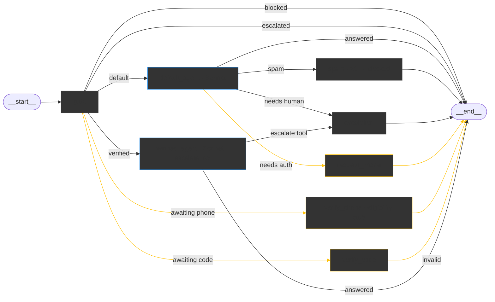

```mermaid
graph LR
    classDef llm fill:#333,stroke:#1e88e5
    classDef logic fill:#333,stroke:#616161
    classDef auth fill:#333,stroke:#ffc107

    __START__([__start__])
    gate["gate"]:::logic
    __END__([__end__])

    default_agent["default_agent · Sonnet"]:::llm
    spam["spam · ≥3 → blocked"]:::logic
    escalation["escalation"]:::logic

    request_phone["request_phone"]:::auth
    verify_phone["verify_phone · eligibility stub"]:::auth
    verify_code["verify_code"]:::auth

    verified_agent["verified_agent · Sonnet · escalate tool"]:::llm

    __START__ --> gate

    gate -->|"blocked"| __END__
    gate -->|"escalated"| __END__

    gate -->|"default"| default_agent
    default_agent -->|"answered"| __END__
    default_agent -->|"spam"| spam
    spam --> __END__
    default_agent -->|"needs human"| escalation
    escalation --> __END__

    default_agent -->|"needs auth"| request_phone
    gate -->|"awaiting phone"| verify_phone
    gate -->|"awaiting code"| verify_code
    request_phone --> __END__
    verify_phone --> __END__
    verify_code -->|"invalid"| __END__

    gate -->|"verified"| verified_agent
    verified_agent -->|"answered"| __END__
    verified_agent -->|"escalate tool"| escalation

    linkStyle 9,10,11,12,13,14 stroke:#ffc107
```
